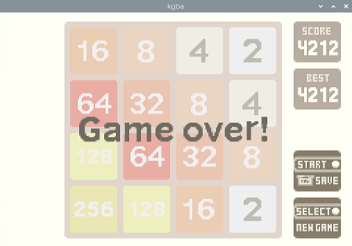

# kgba

An experimental Game Boy Advance emulator written in Rust using KVM.



(from https://basil-termini.itch.io/2048-advance)

## Requirements

- Raspberry Pi 4 or another aarch64 Linux host with ARM KVM support
- `/dev/kvm` available to the user running `cargo run`
- SDL2 development files and runtime library
- Rust toolchain with Rust 2024 edition support
- 32-bit ARM bare-metal toolchain for building the bundled `kgba-bios` image

The current development environment is:

```text
Debian GNU/Linux 13 (trixie)
DEBIAN_VERSION_FULL=13.2
Architecture: aarch64
```

On Debian 13, the system packages needed for `cargo run` are:

```bash
sudo apt install build-essential libsdl2-dev gcc-arm-none-eabi binutils-arm-none-eabi 
```

For KVM, make sure the kernel exposes `/dev/kvm` and the current user can open
it. On Debian this usually means loading/enabling the KVM support for the board
and adding the user to the `kvm` group when `/dev/kvm` is group-owned by `kvm`.

## Running

Pass a ROM path to run it through the KVM backend. This is the default execution path.

```bash
cargo run -- <ROM PATH>
```

For interactive or timing-sensitive runs, prefer the release profile. The dev
profile can spend enough time in host-side rendering, SDL present, and debug
checks that it looks slower or less responsive than the emulator path actually
is.

```bash
cargo run --release -- <ROM PATH>
```

Use `--duration-ms` to run for a fixed amount of time and then exit.

```bash
cargo run --release -- --duration-ms 3000 <ROM PATH>
```

## Key Mapping

The current SDL keyboard mapping is:

| GBA button | Keyboard |
| --- | --- |
| D-pad Up | `W` |
| D-pad Down | `S` |
| D-pad Left | `A` |
| D-pad Right | `D` |
| A | `L` |
| B | `K` |
| L | `I` |
| R | `O` |
| Start | `Enter` |
| Select | `Backspace` |

## Software Fallback

For development checks without KVM, use the limited software runner for this sample ROM.
It is never selected automatically; it runs only when `--software` is explicitly passed.

```bash
cargo run --release -- --software --headless <ROM PATH>
cargo run --release -- --software --duration-ms 1000 <ROM PATH>
```

`--software` is only a development fallback for tests and host-side debugging. The main execution path is the KVM backend.
